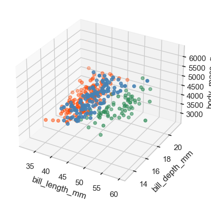
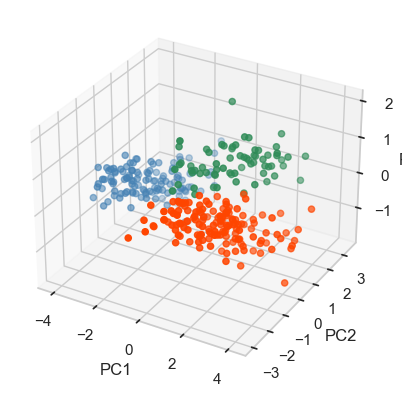

# holopheno

<!-- WARNING: THIS FILE WAS AUTOGENERATED! DO NOT EDIT! -->

## Install

``` sh
pip install holopheno
```

## How to use

``` python
import holopheno
import pandas as pd
from palmerpenguins import load_penguins


penguins = load_penguins()
```

### You can use holopheno to easily visualize scatters of individual data points in the chosen dimensions

To do that, you need to first tell indicate which are the independent
variable columns and which are the dependent variable columns in the
dataframe

``` python
x_columns = ['species', 'island', 'sex']
y_columns = [
                    'bill_length_mm', 
                   'bill_depth_mm', 
                   'bill_depth_mm', 
                   'body_mass_g', 
                  ]
```

### `.read_data()` loads the data and gives you some basic info about the data

``` python
penguins_h = holopheno.read_data(penguins, x = x_columns, y = y_columns)
```

    Data info: 

    sample_size 333
    unique species values ['Adelie' 'Gentoo' 'Chinstrap']
    unique island values ['Torgersen' 'Biscoe' 'Dream']
    unique sex values ['male' 'female']

### `.scatter()` gives you some scatter plots, either in raw metric values or z-scores (scaled)

``` python
penguins_h.scatter('bill_length_mm', 'body_mass_g', group_by = 'species', type = 'raw');
# penguins_h.scatter('bill_length_mm', 'body_mass_g', group_by = 'species', type = 'scaled');
```

    Plotting for the conditions species:
    Adelie
    Gentoo
    Chinstrap


### `.scatter_3d` gives you a 3D interactive view

``` python
palette = {'Adelie': 'orangered', 'Gentoo': 'steelblue', 'Chinstrap': 'seagreen'}
f = penguins_h.scatter_3d(['bill_length_mm', 'bill_depth_mm', 'body_mass_g'], color_by = 'species', palette = palette, type = 'raw');
```



``` python
pca, f = penguins_h.dim_red_by_pca()

pca = penguins_h.dim_red_by_pca(n_components = 3, plot_variance_explained= False)
penguins_h.transform_with_pca(pca)
```


``` python
# %matplotlib widget
palette = {'Adelie': 'orangered', 'Gentoo': 'steelblue', 'Chinstrap': 'seagreen'}
f1 = penguins_h.scatter_3d(['PC1', 'PC2', 'PC3'], color_by = 'species', palette = palette, type = 'scaled');
```


